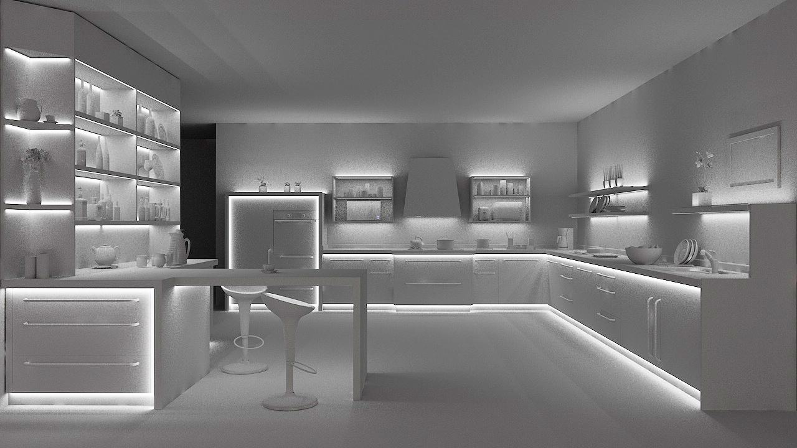
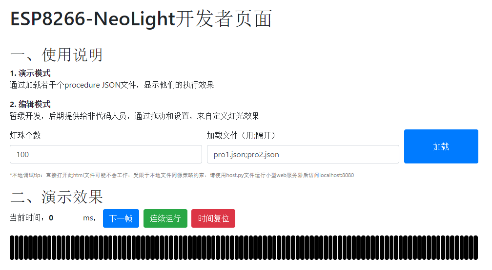

# esp8266-neoLight

ESP8266无线WIFI单片机控制NeoPixel全彩LED灯条

## Design

全彩LED灯条经常被用为大型广告字的灯源，往往看起来只是简单的颜色变化和运动。但是灯光的效果的运用不仅仅局限于人眼直接看到，很多室内的灯光艺术能够做出科幻美学效果



但是，静态的灯光不能满足我们的要求，我们希望灯光能够是**“响应式”**的，会根据人的行为和周边的变化去动态改变，当然这些功能的设计还需要更多的交互设备，比如摄像头、传感器等，本项目作为灯光的基础设置存在，需要保证以下几点方便后期的创作：

- Flexibility：用户可以通过网络远程控制灯条的行为，这个控制必需足够强大，精细到20ms防止人眼闪烁
- Modularity：开发交互式操作时，仅使用远程API接口，且整个过程可以被monitor，方便调试和维护
- Share：用户可以自定义灯光的效果，给自己创造出舒适的工作环境

### 一个demo应用

在实验室内，实验桌下布置灯条，隐藏起来平时不会注意到，当灯光开启时地面呈现各种颜色。当有人希望使用某个工具时，在系统内搜索工具，然后灯光会指引使用者到达某一个实验桌，甚至进一步地，某一个储物柜。

还可以做随人体运动的灯光效果，两侧地面均有这样的灯光效果，通过人体识别的技术定位人体，然后地面灯光随人的行走而运动

## Implementation

## 网络模型

使用MQTT的publish/subscribe模型，结合websocket实现浏览器内设备访问，详见onedawn内部文档

## LED元件

使用WS2812灯珠的灯带（NeoPixel），串行控制

## 灯光动画

这个项目既需要实现对灯光的任意控制，又需要实现高性能（即人眼不可见的闪烁和动画延迟）。一般来说，对于一个固定的灯光变化pattern，使用C代码就可以很好地展现；但是加载一个远程的binary code既不安全也不稳定，那么就需要我们去抽象，到底什么操作对于一个灯条是必需的？

#### 1. 颜色变化连续性

一般来说，每颗灯珠间距大约1~2cm，如果相邻的两个颜色非常不同，视觉感官将会很差。在这种情况下，我们可以通过描述有限个“关键帧”，其他中间的颜色过渡是渐变的。描述一个关键帧类似下面JSON数据格式

```json
{
    "type": "frame",
    "subtype": "gradual",
    "data": [
        [0, R, G, B],
        [30, R, G, B],
        [40, 0, 0, 0],
        [41, R, G, B],
        [42, 0, 0, 0]
    ]
}
```

上面这个描述信息，从0到30号的灯珠，是渐变地变化过去的，比较有趣的是，40和42号都是不亮，而41号指定了颜色，那么就表现为一串灯珠里面只有一颗是亮的，说明这个表示方式有一定的通用性。

那么非线性的变化可以表示吗？就好像一条曲线，如果只是收尾连接直线，那么两个图形一点都不像，那么如果在曲线中间点很多的点，再把这些点连接起来，就与原来的曲线很类似了。说白了这个问题就是人眼辨识度的问题，通过更多的插值，可以更好地贴合原来的设计，但相应地增加了信息量，这是一个tradeoff

#### 2. 时间变化连续性

LED过快地闪烁对人来说是很难受的，那么跟颜色的空间变化连续性同理，我们只需要描述关键帧

```json
{
    "type": "sleep",
    "subtype": "gradual",
    "time": 5000
}
```

这样一个过渡帧描述了：上一个颜色帧和下一个颜色帧，之间使用平滑过渡的效果，持续时间为5000ms。同样地，中间插很多的颜色帧，就可以贴合你原本想象的数据

#### 一个例子

```json
{
    "version": 1,
    "name": "测试样例",
    "mask": 0.5,  // 将已绘制的乘上这个
    "mask_start": 0,  // 闭区间start和end
    "mask_end": 30,
    "procedure": [
        {
            "type": "frame",
            "subtype": "gradual",
            "data": [
                [0, 0, 0, 0],
                [30, 255, 0, 0]
            ]
        },
        {
            "type": "sleep",
            "subtype": "gradual",
            "time": 5000
        },
        {
            "type": "frame",
            "subtype": "gradual",
            "data": [
                [0, 255, 0, 0],
                [30, 0, 0, 0]
            ]
        }
    ]
}
```

这样一个描述表示了：一开始效果是从一边不亮另一边是红的，经过5秒后，序列反转。

这里面的version信息是用来检测是否有能力执行当前操作，版本更新引入新的type，将无法识别。另外`mask`通道百分比，模仿了html的方式，不同的procedure是可以叠加的，顺序为输入文件的顺序，另一个procedure可以覆盖到原来的上面去。比如灯珠原来是200个，我们可以只设置其中30个，然后把z-index调高使得其覆盖，然后`alpha`通道设置透明度等等

## 设计工具

项目提供一个基于网页的调试工具



可以加载json文件并模拟实际显示效果

## 转换工具

由于C语言操作json会有较大困难，动态内存管理引入新的不确定性，这里使用转换器（类似一种简单的编译手段），来讲json数据变为“机器码”

[convert.py](convert.py)

```python

```

